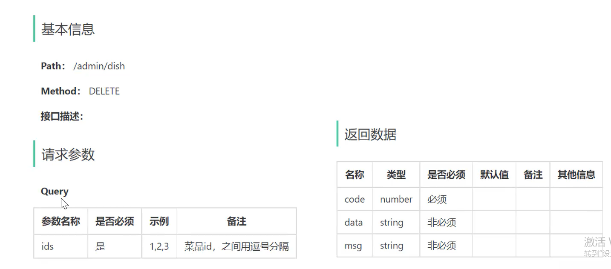
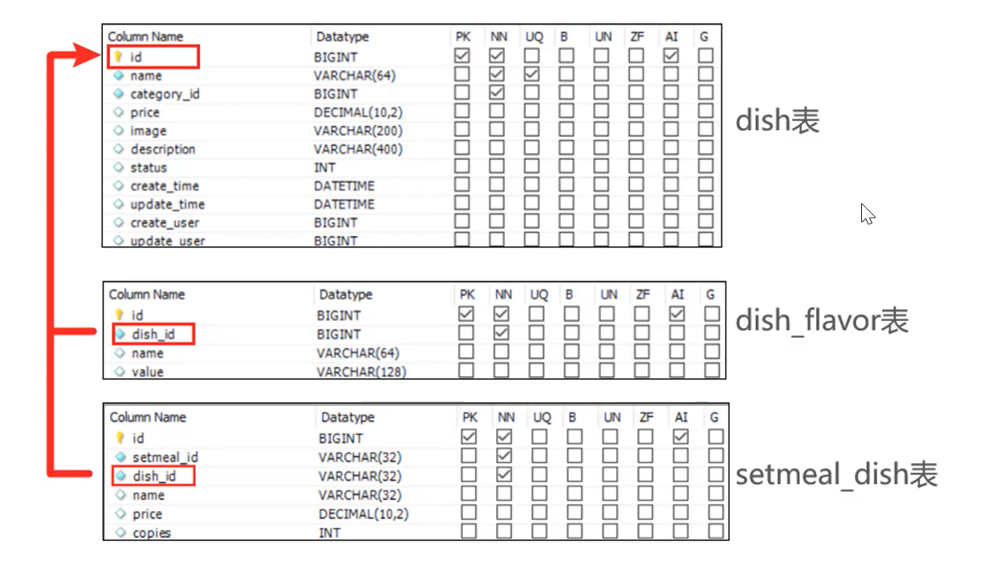

#### 需求分析
 
涉及的类：
 DishServiceImpl 
 SetmealDishMapper 
 SetmealDishMapper.xml 
 MessageConstant 
 DishMapper 
  DishFlavoMapper 

**业务规则：**
* 可以一次删除一个菜品，也可以批量删除菜品
* 起售中的菜品不能删除
* 被套餐关联的菜品不能删除
* 删除菜品后，关联的口味数据也需要删除掉  

**接口设计：**

  
**数据库设计：**
